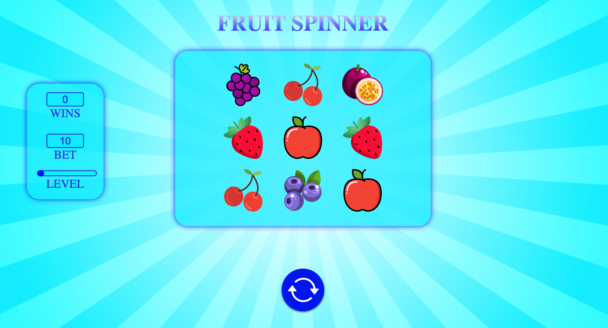

# Slot Game

A simple casino slot game built with React, Redux, Typescript and Vite, featuring SVG backgrounds and symbols from Flaticon.

## Installation

To install and run this project, you'll need to have Node.js and npm installed on your machine. Then, follow these steps:

1. Clone this repository to your local machine.
2. Open the terminal and navigate to the project directory.
3. Run `npm install` to install the project dependencies.
4. Run `npm start` to start the development server.

## Usage

To play the casino slot game, simply spin the reels and see if you can hit a winning combination. You can try this game here: https://helenounsaar.github.io

## Technologies Used

This project was built using:

- React
- Redux
- Typescript
- Vite
- SVG backgrounds from https://www.svgbackgrounds.com
- Symbols from https://www.flaticon.com

## Credits

- SVG backgrounds from https://www.svgbackgrounds.com
- Symbols from https://www.flaticon.com, spin icon is created by Digby Garrett 

